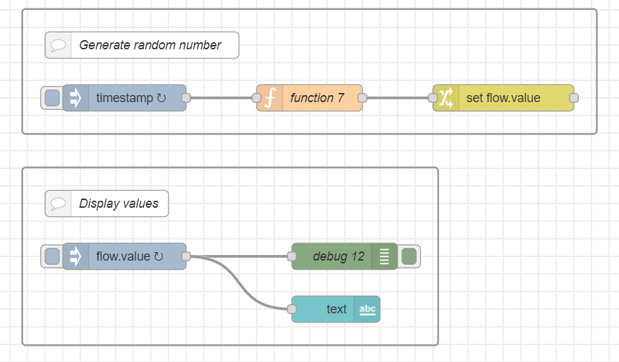
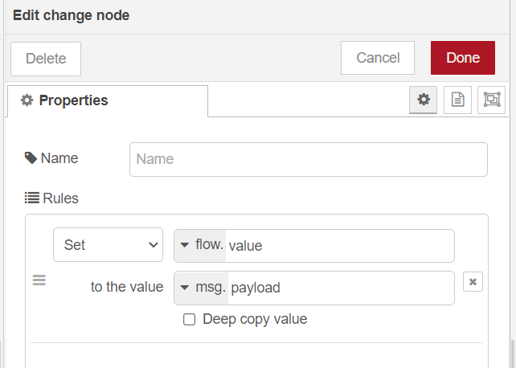
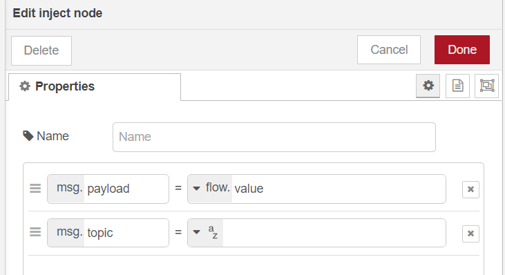
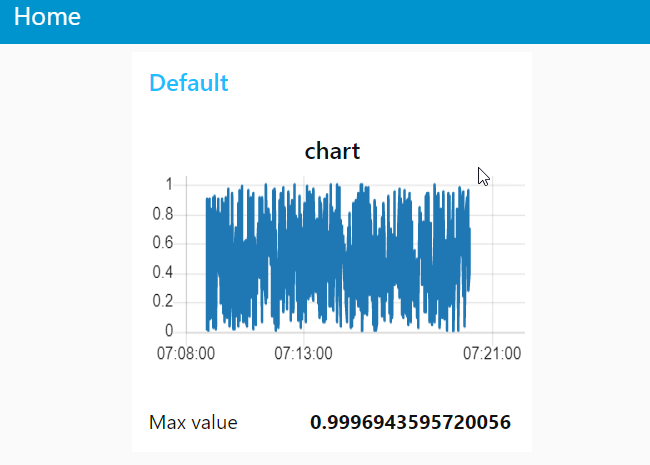

<style>
@import url('https://fonts.googleapis.com/css2?family=Prompt:ital,wght@0,100;0,300;0,400;0,700;1,100;1,300;1,400;1,700&display=swap');

    :root {
    font-family: Prompt;
    --hl-color: #D57E7E;
}
h1 {
  font-family: Prompt
}
</style>

# Production Supporting Systems in Factories

## ระบบสนับสนุนการผลิตในโรงงานอุตสาหกรรม

---

# Context

---

# Scope

The `scope` of a particular context value.

- `Node` - only visible to the node that set the value
- `Flow` - visible to all nodes on the same flow (or tab in the editor)
- `Global` - visible to all nodes

---

## Working on `flow` context

---

## 

---

# `function` node

```js
msg.payload = Math.random();
return msg;
```

---

# `change` node

## 

---

# `inject` node

## 

---

# Sample flow

---



- Show random value (real time).
- Store the maximum value.

---


---

# `function` node

```js
msg.payload = Math.random();
return msg;
```
