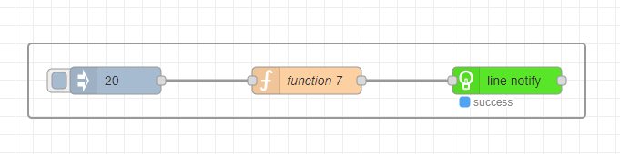
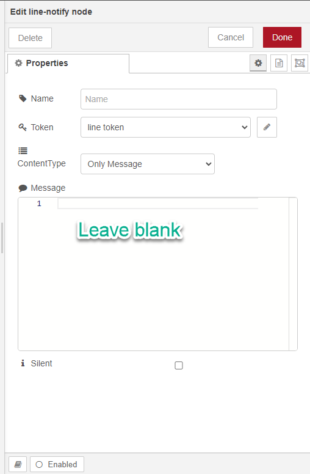

<style>
@import url('https://fonts.googleapis.com/css2?family=Prompt:ital,wght@0,100;0,300;0,400;0,700;1,100;1,300;1,400;1,700&display=swap');

    :root {
    font-family: Prompt;
    --hl-color: #D57E7E;
}
h1 {
  font-family: Prompt
}
</style>

# Production Supporting Systems in Factories

## ระบบสนับสนุนการผลิตในโรงงานอุตสาหกรรม

---

# Line Notify 2

## Easier Implementation

---

# Setup

- Install `node-red-contrib-line-notify`

---

# Flow



---

# `line notify` node



---

# `function` node

```js
const date = new Date();
const datestring = date.toLocaleDateString();
const timestring = date.toLocaleTimeString();

// Customize your message here
const payload = `
🗓 วัน: ${timestring}
🕐 เวลา: ${datestring}
📈 ค่า: ${msg.payload}
`;
msg.payload = "\n" + payload.trim();
return msg;
```

---

# Other nodes

- `delay`
  - Delay messages
- `filter`
  - Block values unless changed.
- `timeout`
  - Install `node-red-contrib-timeout`

---

# Mobile sensors

- Instructions
  - https://pcniuzfskz.joplinusercontent.com/shares/4ctPEsAVbWv3OoNsILnp1t
- Instructional VDO
  - https://youtu.be/r5FpylTGZPI
- Node-Red flow
  - https://youtu.be/MEFTaTdLnhE
