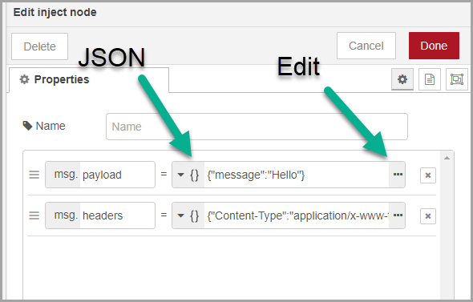
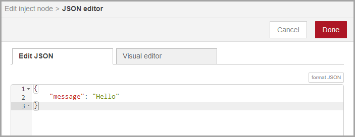
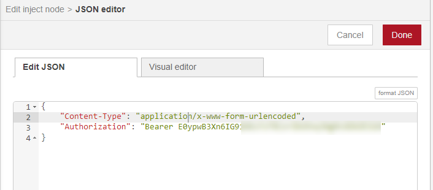
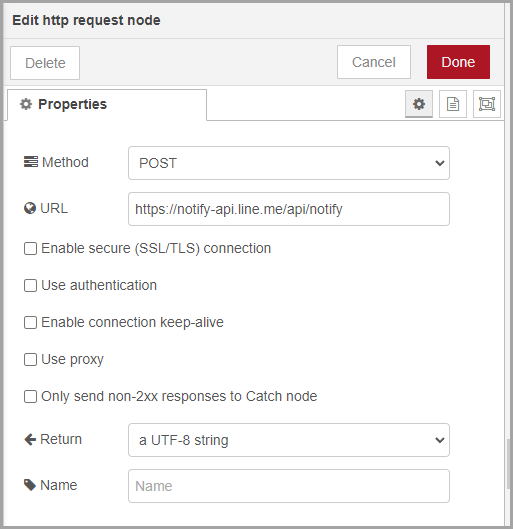
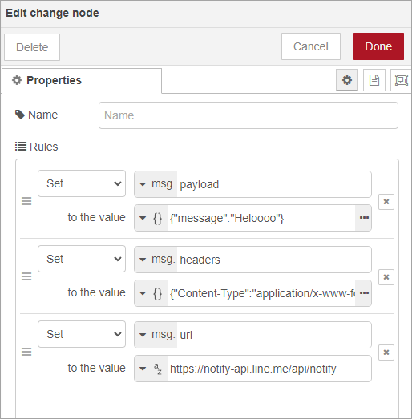

<style>
@import url('https://fonts.googleapis.com/css2?family=Prompt:ital,wght@0,100;0,300;0,400;0,700;1,100;1,300;1,400;1,700&display=swap');

    :root {
    font-family: Prompt;
    --hl-color: #D57E7E;
}
h1 {
  font-family: Prompt
}
</style>

# Production Supporting Systems in Factories

## ระบบสนับสนุนการผลิตในโรงงานอุตสาหกรรม

---

# Line Notify

---

- สร้างกลุ่ม LINE ภายใน Group
- ไปที่ https://notify-bot.line.me/en/
  - Login (need to verify number on smart phone)
  - Go to `My page`
  - Click `Generate token`
  - Enter `Token Name` and select a chat room.
  - Copy the token and store it somewhere.

---

- Let send a line notification through `Node-Red`

  - Flow
    

---

- `inject` node



---

- Set `msg.payload` to (JSON)

```JSON
{
  "message":"Hello"
}
```



---

- Set `msg.headers` to (JSON)

```JSON
{
  "Content-Type": "application/x-www-form-urlencoded",
  "Authorization": "Bearer <<YOUR LINE TOKEN>>"
}
```



---

- `http request` node
  - Method: `POST`
  - URL: `https://notify-api.line.me/api/notify`

---



---

- Add `debug` node to see the output.
  - You can inspect the error.
- Try injecting to see if the notification.

---

# Extra

- Make a server that send the message to `Line`.
  - The message comes from the `POST` request.

---

# Extra


---

# Extra


